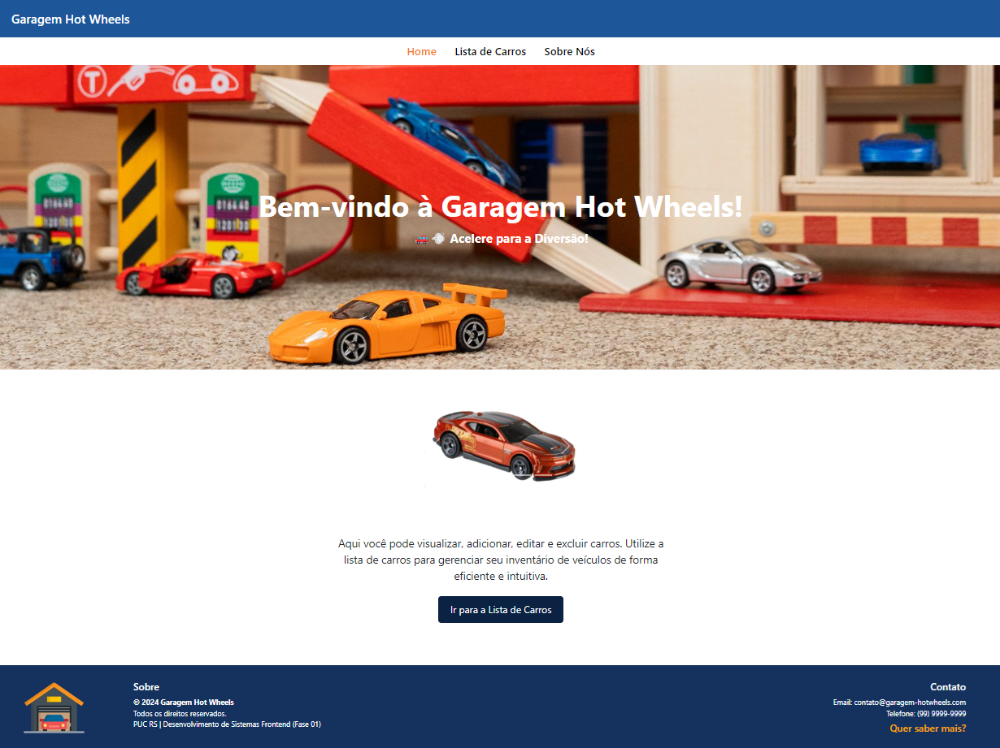
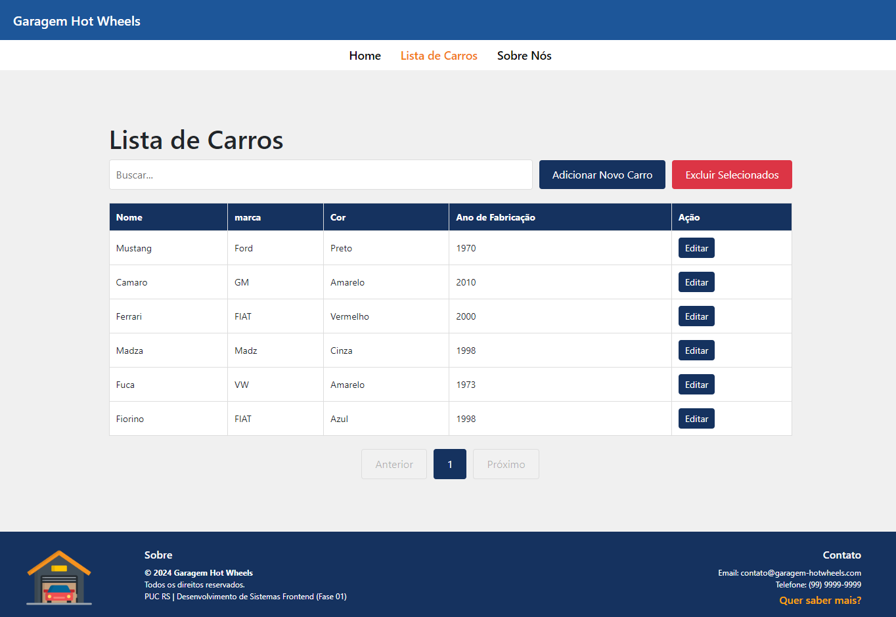
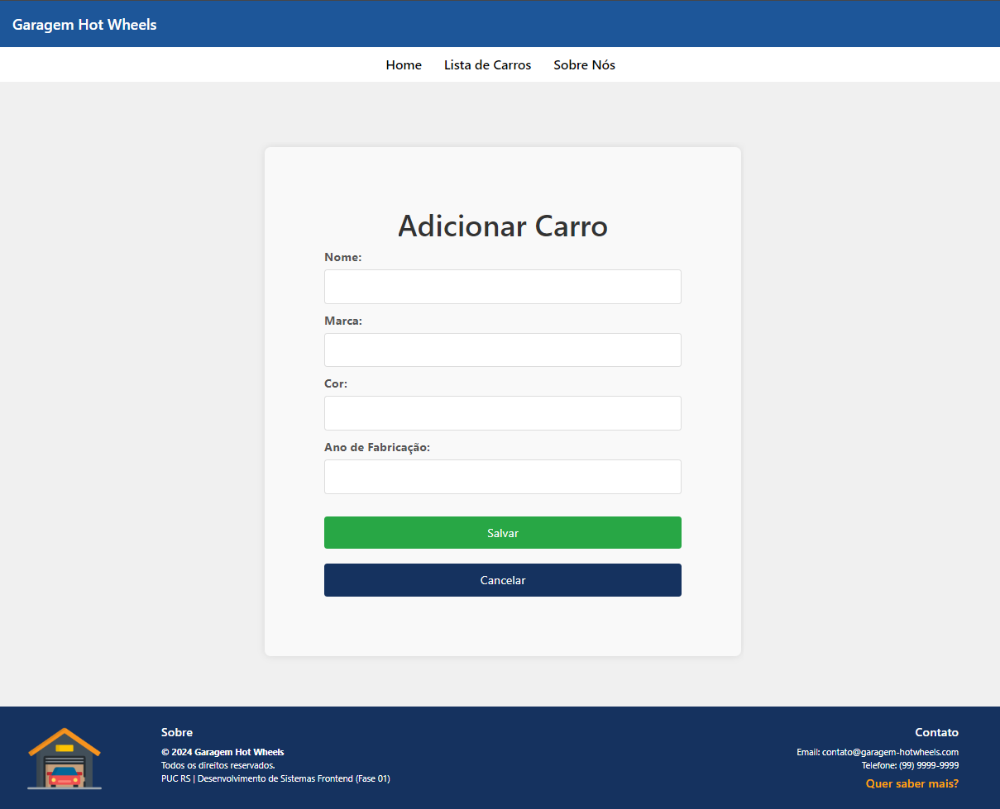
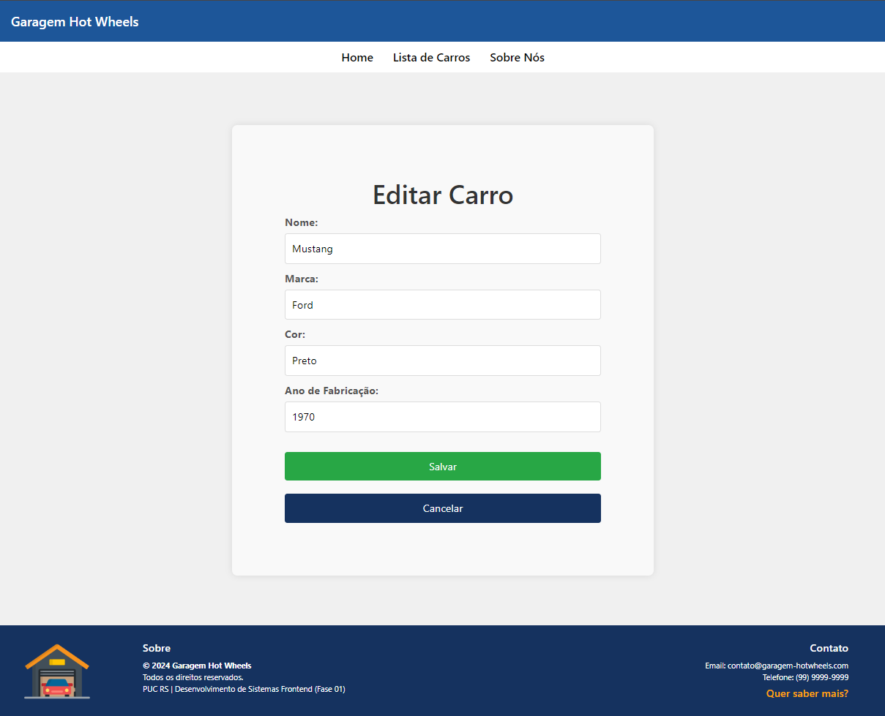
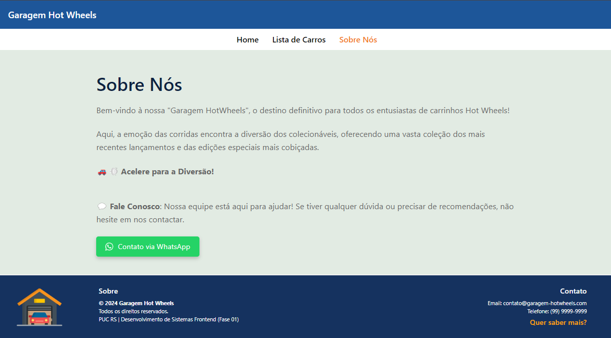
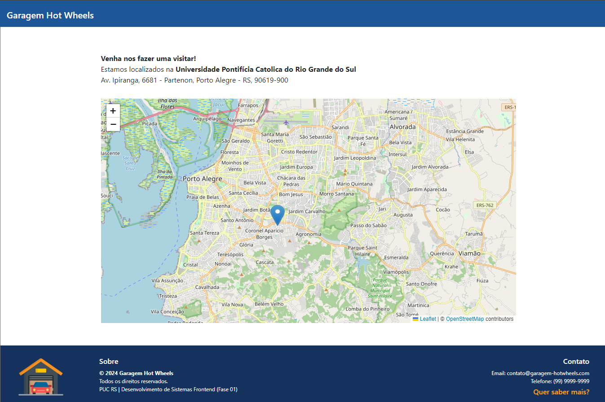

<h1 align="center">PUCRS | Desenvolvimento de Sistemas Frontend</h1>

## Nome: `Thiago Roldão Pinheiro Costa`

<p align="center">
Projeto individual da disciplina Desenvolvimento de Sistemas Frontend - PUCRS<br/>
</p>

<p align="center">
<a href="#-funcionalidades">Funcionalidades</a>&nbsp;&nbsp;&nbsp;|&nbsp;&nbsp;&nbsp;
<a href="#-tecnologias">Tecnologias</a>&nbsp;&nbsp;&nbsp;|&nbsp;&nbsp;&nbsp;
<a href="#-instalação">Instalação</a>&nbsp;&nbsp;&nbsp;|&nbsp;&nbsp;&nbsp;
<a href="#-componentes">Componentes</a>&nbsp;&nbsp;&nbsp;|&nbsp;&nbsp;&nbsp;
<a href="#-bibliotecas">Bibliotecas</a>&nbsp;&nbsp;&nbsp;|&nbsp;&nbsp;&nbsp;
<a href="#-conclusão">Conclusão</a>&nbsp;&nbsp;&nbsp;|&nbsp;&nbsp;&nbsp;
<a href="#-licença">Licença</a>

## 💻 Funcionalidades

Este projeto foi desenvolvido utilizando React para proporcionar uma plataforma completa de gerenciamento de carrinhos Hot Wheels. Com ele, você pode:

- **Cadastro de Carrinhos:** Formulário para inclusão de novos carrinhos com validações.
- **Edição e Exclusão:** Atualize ou remova carrinhos existentes facilmente.
- **Visualização da Lista:** Acesse e visualize todos os carrinhos cadastrados.
- **Feedbacks e Validações:** Mensagens de erro e validações para uma experiência de usuário aprimorada.

Além disso, o sistema oferece **validações e feedbacks** em tempo real para garantir uma experiência de usuário intuitiva e sem erros. Navegue pela interface simples e direta para gerenciar seu inventário de forma prática e divertida!

## 🚀 Tecnologias

Esse projeto foi desenvolvido utilizando as seguintes tecnologias:

- **React:** Biblioteca JavaScript para a construção da interface.
- **React Router DOM:** Navegação entre diferentes páginas do aplicativo.
- **React Bootstrap:** Componentes responsivos para a interface do usuário.

## 🔖 Instalação

### API Backend

Este projeto utiliza a `branch main` da **API** [hotwheels-api](https://github.com/adsPucrsOnline/DesenvolvimentoFrontend/). Para utilizá-la, siga as instruções de download e instalação abaixo.

1. Clone o repositório:

   ```bash
   git clone https://github.com/adsPucrsOnline/DesenvolvimentoFrontend.git
   ```

2. Entre pasta hotwheels-api:

   ```bash
   cd DesenvolvimentoFrontend
   ```

   ```bash
   cd hotwheels-api
   ```

3. Rode npm install para instalar as dependências do projeto:

   ```bash
   npm install
   ```

4. E em seguida, npm start, para iniciar a execução do projeto.

   ```bash
   npm start
   ```

### Front-End

Siga as instruções abaixo para instalar e utilizar este front-end:

- **Importante**: Assegure-se de que a API Hotwheels esteja em operação antes de iniciar o front-end.

1. Clone o repositório:

   ```bash
   git clone https://github.com/thiagorpc/pucrs-desenvolvimento-sistemas-frontend-fase-2.git
   ```

2. Entre pasta do projeto:

   ```bash
   cd pucrs-desenvolvimento-sistemas-frontend-fase-2
   ```

3. Rode npm install para instalar as dependências do projeto:

   ```bash
   npm install
   ```

4. E em seguida, npm start, para iniciar a execução do projeto.

   ```bash
   npm start
   ```

5. Executar os testes.
   ```bash
   npm run test
   ```

Após execução do projeto, este é o resultado esperado no navegador:

- **Página de entrada**
<p align="center">
  
</p>

- **Lista de Carros**
<p align="center">
  
</p>

- **Lista de Carros | Adicionar Carro**
<p align="center">
  
</p>

- **Lista de Carros | Editar Carro**
<p align="center">
  
</p>

- **Sobre Nós**
<p align="center">
  
</p>

- **Sobre Nós | Mapa**
<p align="center">
  
</p>

## 💻 Componentes

Este projeto é organizado em vários componentes React localizados no diretório ./src/Components. Cada componente tem uma responsabilidade específica para garantir a organização e manutenções eficientes.

### Componentes

- **Content:** É responsável pelo conteúdo exibido na página inicial. Ele fornece uma visão geral do site e do que os visitantes podem esperar.

- **About:** Fornece uma visão geral do projeto e inclui um botão para contato via WhatsApp. Também apresenta um mapa com a localização fictícia da loja "Garagem Hot Wheels", utilizando Leaflet e OpenStreetMap.

- **Header:** É um componente de cabeçalho que exibe o título da página atual. Ele recebe o título via props, permitindo a personalização do texto de acordo com a página que está sendo visualizada.

- **Footer:** É responsável por exibir o rodapé em todas as páginas do site. Ele inclui informações adicionais que você deseja que os visitantes vejam no final de cada página.

- **NavBar:** É o componente de navegação principal, permitindo que os usuários acessem as páginas "Home", "Lista de Carros" e "Sobre".

- **CarList:** Componente responsável pela exibição e manipulação da lista de carros, incluindo listagem e exclusão. A adição e edição são gerenciadas pelo componente **CarForm** , formando um sistema completo de CRUD. O **App** carrega e gerencia a lista de carros, mantendo a separação de responsabilidades entre os componentes.

- **CarList:** Lida com a inclusão ou alteração de carros. Ele valida as entradas do usuário e se comunica com o CarList através de props para atualizar a lista conforme necessário. Este componente garante que todos os dados dos carros sejam tratados corretamente e que as operações de CRUD sejam realizadas de maneira eficaz.

- **Mapa:** Exibe um mapa interativo utilizando o Leaflet e o OpenStreetMap. O componente mostra a localização fictícia da loja **Garagem Hot Wheels** e permite interagir com o mapa para explorar a área ao redor. Ideal para adicionar um contexto visual e geográfico ao projeto.

- **WhatsAppButton:** Fornece um botão estilizado que, quando clicado, redireciona o usuário para uma conversa no WhatsApp com o contato fornecido. É útil para facilitar a comunicação direta com a equipe de suporte ou administração do projeto.

- **ConfirmActionModal:** Modal que pede confirmação antes de realizar uma ação importante, como excluir um item.

## 📝 Bibliotecas

Este projeto utiliza o **Leaflet** e o **OpenStreetMap** para fornecer uma experiência de mapeamento interativa com uma geolocalização fictícia da loja **Garagem Hot Wheels**.

### O que é o Leaflet?

[Leaflet](https://leafletjs.com/) é uma das bibliotecas JavaScript mais populares para criar mapas interativos. É leve, fácil de usar e oferece uma vasta gama de funcionalidades para trabalhar com mapas, como zoom, pan e sobreposições de dados.

### O que é o OpenStreetMap?

[OpenStreetMap (OSM)](https://www.openstreetmap.org/) é um projeto colaborativo que cria um mapa livre e editável do mundo. Os dados são fornecidos por uma comunidade de mapeadores voluntários e estão disponíveis para qualquer pessoa usar e contribuir.

### Como o Leaflet e o OpenStreetMap são utilizados no projeto?

Neste projeto, o Leaflet é utilizado para integrar mapas interativos em nossa aplicação. Os mapas são baseados nos dados fornecidos pelo OpenStreetMap, o que permite aos usuários visualizar e interagir com os mapas de forma detalhada e dinâmica.

#### Principais Funcionalidades

- **Exibição de Mapas:** Os mapas são carregados e exibidos utilizando o Leaflet, com tiles baseados em OpenStreetMap.
- **Marcadores e Anotações:** É possível adicionar marcadores e anotações aos mapas para destacar locais importantes.
- **Interatividade:** Os usuários podem interagir com os mapas, como dar zoom e arrastar, para explorar diferentes áreas.

## 🚗💨 Conclusão

Este projeto em React oferece uma interface completa para gerenciar uma coleção de carros Hot Wheels com funcionalidades de CRUD. Inclui navegação intuitiva, validação de formulários e integração com Leaflet e OpenStreetMap para visualização de localização. É uma solução prática e eficiente para adicionar, editar e excluir carros com facilidade.

## 📝 Licença

Esse projeto está sob a licença MIT.
